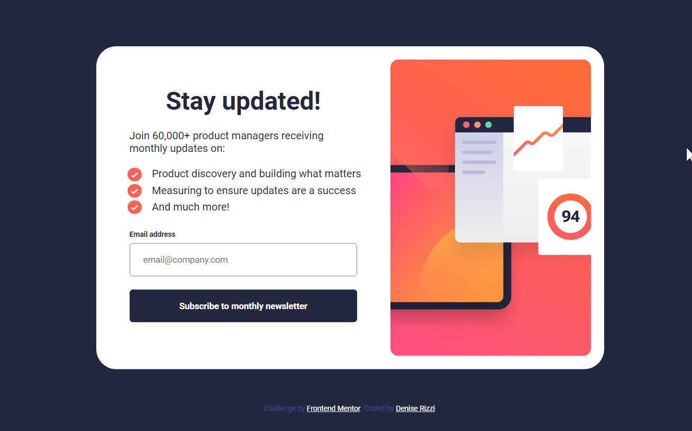

# Frontend Mentor - Newsletter sign-up form with success message solution

This is a solution to the [Newsletter sign-up form with success message challenge on Frontend Mentor](https://www.frontendmentor.io/challenges/newsletter-signup-form-with-success-message-3FC1AZbNrv). Frontend Mentor challenges help you improve your coding skills by building realistic projects. 

## Overview

In the learning path I'm following on Frontend Mentor I'm right now focusing on forms and this is a nice challenge to practise it. 
I'm also practising HTML and CSS, trying to stick to the original design as much as I can. 

### The challenge

Users should be able to:

- Add their email and submit the form
- See a success message with their email after successfully submitting the form
- See form validation messages if:
  - The field is left empty
  - The email address is not formatted correctly
- View the optimal layout for the interface depending on their device's screen size
- See hover and focus states for all interactive elements on the page

### Screenshot

### Links

- Live Site URL: https://newsletter-sign-up-github-io-bice.vercel.app/

## My process

The HTML and CSS part was quite easy and I'm happy with the result and with my progress. 
The javascript part was more challenging since I'm just learning DOM manipulation.

### Built with

- Semantic HTML5 markup
- CSS custom properties
- Flexbox
- Javascript

### What I learned

I learned how to deal with forms, and I know more about DOM manipulation

## Author

- Frontend Mentor - [@saccoViola](https://www.frontendmentor.io/profile/saccoViola)
